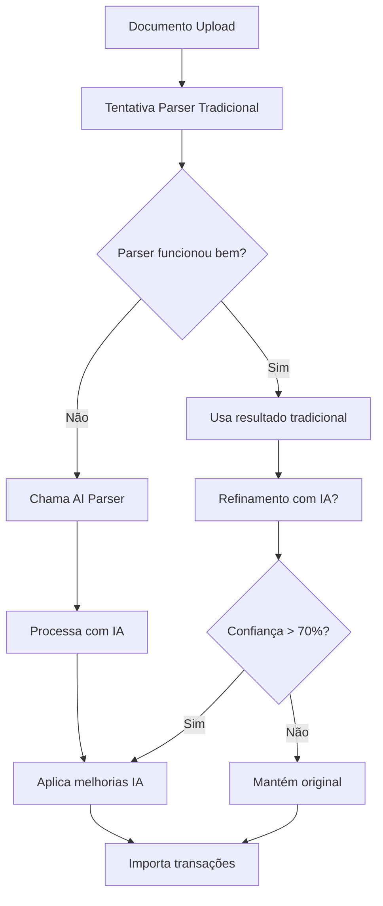

# AI Transaction Parser - Documentação Completa

## Visão Geral

O AI Transaction Parser é um sistema avançado de processamento de dados financeiros que utiliza Inteligência Artificial (GPT-4o-mini) para interpretar, estruturar e normalizar informações extraídas de documentos desestruturados (PDF, Excel, CSV, texto).

### Problema Resolvido

- **Dados desorganizados**: Extratos bancários em diferentes formatos
- **Colunas inconsistentes**: Nomes variados para os mesmos campos
- **Formatos diferentes**: Datas, valores e textos em múltiplos padrões
- **Bancos diferentes**: Cada instituição tem seu próprio layout

## Arquitetura do Sistema

### 1. Componentes Principais

```
┌─────────────────────────────────────────────────────────────┐
│                    AI Transaction Parser                    │
├─────────────────────────────────────────────────────────────┤
│  lib/ai-transaction-parser.ts                              │
│  ├── parseTransactionsWithAI()                             │
│  ├── hybridParseTransactions()                             │
│  └── refineTransactionsWithAI()                            │
├─────────────────────────────────────────────────────────────┤
│  Integration Layer                                          │
│  ├── lib/pdf-processing.ts (atualizado)                    │
│  └── lib/excel-processing.ts (atualizado)                  │
├─────────────────────────────────────────────────────────────┤
│  API Layer                                                  │
│  └── app/api/ai/parse-transactions/route.ts                │
├─────────────────────────────────────────────────────────────┤
│  UI Components                                              │
│  ├── components/ai/ai-transaction-parser-demo.tsx          │
│  └── app/(dashboard)/ai-parser/page.tsx                     │
└─────────────────────────────────────────────────────────────┘
```

### 2. Fluxo de Processamento

#### Fluxo Híbrido (Recomendado)


## Funcionalidades Detalhadas

### 1. Identificação Automática de Estrutura

O sistema analisa os dados e identifica automaticamente:

| Campo Original | Campo Normalizado | Exemplos |
|----------------|-------------------|----------|
| "Lançamento" | description | "Transferência PIX" |
| "Valor (R$)" | amount | "1.234,56" |
| "Data Mov." | date | "15/03/2024" |
| "Tipo" | type | "CRÉDITO/DÉBITO" |

### 2. Normalização de Dados

#### Datas
- **Entrada**: DD/MM/YYYY, DD/MM/YY, YYYY-MM-DD, etc.
- **Saída**: YYYY-MM-DD (ISO)
- **Exemplo**: "15/03/24" → "2024-03-15"

#### Valores
- **Entrada**: 1.234,56 | 1234.56 | 74,9
- **Saída**: 1234.56 (decimal padrão)
- **Exemplo**: "R$ 1.234,56" → 1234.56

#### Texto
- Remove espaços extras
- Mantém descrição original fiel
- Limita a 500 caracteres

### 3. Inferência de Tipo (Crítico)

Regras de classificação automática:

```typescript
function inferType(description: string, amount: number): TransactionType {
  // Baseado no valor
  if (amount < 0) return "EXPENSE"
  if (amount > 0) return "INCOME"
  
  // Baseado na descrição
  const lowerDesc = description.toLowerCase()
  
  if (lowerDesc.includes("transfer") || 
      lowerDesc.includes("ted") || 
      lowerDesc.includes("pix")) {
    return "TRANSFER"
  }
  
  if (lowerDesc.includes("recebido") || 
      lowerDesc.includes("credito") || 
      lowerDesc.includes("salario")) {
    return "INCOME"
  }
  
  if (lowerDesc.includes("compra") || 
      lowerDesc.includes("debito") || 
      lowerDesc.includes("pagamento")) {
    return "EXPENSE"
  }
  
  return "EXPENSE" // Default mais seguro
}
```

### 4. Classificação Inteligente de Categorias

Mapeamento automático baseado em padrões:

| Padrões na Descrição | Categoria |
|----------------------|-----------|
| "farmacia", "droga", "remedio" | DROGARIA |
| "uber", "99", "taxi" | TRANSPORTE |
| "netflix", "spotify", "prime" | ENTRETENIMENTO |
| "mercado", "supermercado", "carrefour" | ALIMENTAÇÃO |
| "aluguel", "condominio", "iptu" | MORADIA |
| "escola", "curso", "faculdade" | EDUCAÇÃO |
| "hospital", "medico", "plano" | SAÚDE |
| "salario", "holerite", "renda" | RENDA |
| Desconhecido | OUTROS |

### 5. Sistema de Confiança

Cada transação recebe um score de confiança (0-1):

```typescript
interface TransactionWithConfidence {
  date: string
  description: string
  amount: number
  type: "INCOME" | "EXPENSE" | "TRANSFER"
  category: string
  confidence: number // 0.0 a 1.0
}
```

**Interpretação dos Scores:**
- **0.9-1.0**: Alta confiança (dados claros e estruturados)
- **0.7-0.9**: Média confiança (alguma ambiguidade resolvida)
- **0.5-0.7**: Baixa confiança (muita inferência)
- **< 0.5**: Muito baixa (revisão manual recomendada)

## Implementação Técnica

### 1. Core Parser (`lib/ai-transaction-parser.ts`)

```typescript
export async function parseTransactionsWithAI(
  rawData: string | any[] | Record<string, any>,
  options: {
    sourceType?: 'pdf' | 'excel' | 'csv' | 'text'
    bankHint?: string
    existingCategories?: string[]
    confidence?: boolean
  } = {}
): Promise<AIParserResult>
```

**Parâmetros:**
- `rawData`: Dados brutos do documento
- `sourceType`: Tipo de fonte para contexto
- `bankHint`: Dica sobre o banco (detectado automaticamente)
- `existingCategories`: Categorias conhecidas do usuário
- `confidence`: Incluir scores de confiança

### 2. Hybrid Parsing

```typescript
export async function hybridParseTransactions(
  rawData: string,
  traditionalParser: () => any[],
  options: {
    minConfidence?: number // Default: 0.8
  }
): Promise<AIParserResult>
```

**Estratégia:**
1. Executa parser tradicional
2. Se sucesso > 80%, usa tradicional
3. Senão, fallback para IA
4. Refina resultado com IA se disponível

### 3. Refinement Engine

```typescript
export async function refineTransactionsWithAI(
  transactions: ParsedTransaction[],
  options: {
    improveCategories?: boolean
    improveTypes?: boolean
  }
): Promise<AIParserResult>
```

## Integração com Sistema Existente

### 1. PDF Processing Pipeline

```typescript
// lib/pdf-processing.ts (modificado)
const rows = parseStatementByBank(text)

if (rows.length === 0) {
  // Fallback AI
  const aiResult = await hybridParseTransactions(text, () => [], {
    sourceType: 'pdf',
    bankHint: detectBankFromText(text)
  })
  transactions = aiResult.transactions
} else {
  // Refine traditional result
  const refined = await refineTransactionsWithAI(transactions)
  if (refined.summary.confidence > 0.7) {
    transactions = refined.transactions
  }
}
```

### 2. Excel Processing Pipeline

```typescript
// lib/excel-processing.ts (modificado)
const jsonData = XLSX.utils.sheet_to_json(worksheet)

if (transactions.length === 0) {
  // AI Fallback
  const aiResult = await hybridParseTransactions(
    JSON.stringify(jsonData), 
    () => [], 
    { sourceType: 'excel' }
  )
  transactions = aiResult.transactions
}
```

## API Endpoint

### POST `/api/ai/parse-transactions`

**Request:**
```json
{
  "data": "dados brutos aqui...",
  "options": {
    "sourceType": "pdf",
    "confidence": true,
    "existingCategories": ["ALIMENTAÇÃO", "TRANSPORTE", "ENTRETENIMENTO"]
  }
}
```

**Response:**
```json
{
  "transactions": [
    {
      "date": "2024-03-15",
      "description": "Supermercado ABC",
      "amount": 125.50,
      "type": "EXPENSE",
      "category": "ALIMENTAÇÃO",
      "confidence": 0.95
    }
  ],
  "summary": {
    "totalProcessed": 5,
    "successful": 5,
    "confidence": 0.92,
    "notes": "All transactions processed successfully"
  }
}
```

## Componentes UI

### 1. AI Transaction Parser Demo

Localização: `components/ai/ai-transaction-parser-demo.tsx`

**Funcionalidades:**
- Upload de dados em diferentes formatos
- Amostras pré-configuradas (PDF, Excel, CSV, texto)
- Visualização de resultados em tempo real
- Indicadores de confiança
- Resumo estatístico

### 2. Página de Demonstração

Localização: `app/(dashboard)/ai-parser/page.tsx`

Acessível em: `/dashboard/ai-parser`

## Casos de Uso

### 1. PDF de Extrato Bancário

**Entrada:**
```
EXTRATO BANCO DO BRASIL
Data Histórico Valor
15/03/2024 Supermercado ABC -125,50
15/03/2024 Salário Mensal 5.000,00
16/03/2024 Uber Viagem -45,80
```

**Saída:**
```json
[
  {
    "date": "2024-03-15",
    "description": "Supermercado ABC",
    "amount": 125.50,
    "type": "EXPENSE",
    "category": "ALIMENTAÇÃO",
    "confidence": 0.98
  },
  {
    "date": "2024-03-15",
    "description": "Salário Mensal",
    "amount": 5000.00,
    "type": "INCOME",
    "category": "RENDA",
    "confidence": 0.95
  }
]
```

### 2. Excel Desestruturado

**Entrada:**
| Data | Descrição | Valor |
|------|-----------|-------|
| 15/03 | Netflix | 39,90 |
| 16/03 | Uber | 45,80 |

**Saída:**
```json
[
  {
    "date": "2024-03-15",
    "description": "Netflix",
    "amount": 39.90,
    "type": "EXPENSE",
    "category": "ENTRETENIMENTO",
    "confidence": 0.92
  }
]
```

## Benefícios

### 1. Para o Usuário
- **Zero configuração**: Funciona com qualquer formato
- **Alta precisão**: IA resolve ambiguidades
- **Economia de tempo**: Importação automática
- **Redução de erros**: Menos digitação manual

### 2. Para a Plataforma
- **Escalabilidade**: Suporta qualquer banco/formato
- **Resiliência**: Fallback automático
- **Melhoria contínua**: IA aprende com uso
- **Diferencial competitivo**: Tecnologia de ponta

## Configuração e Deploy

### 1. Variáveis de Ambiente

```env
# AI Configuration
OPENAI_API_KEY=sk-...
AI_MODEL=gpt-4o-mini
AI_TEMPERATURE=0.1

# Processing Configuration
DOCUMENT_PROCESSING_ENABLED=true
MAX_TRANSACTIONS_PER_DOCUMENT=5000
AI_CONFIDENCE_THRESHOLD=0.7
```

### 2. Dependências

```json
{
  "dependencies": {
    "@ai-sdk/openai": "^0.0.9",
    "ai": "^3.0.0",
    "zod": "^3.22.0"
  }
}
```

## Monitoramento e Logs

### 1. Estrutura de Logs

```json
{
  "type": "ai_parsing",
  "timestamp": "2024-03-15T10:30:00Z",
  "documentId": "uuid",
  "sourceType": "pdf",
  "parsingMethod": "hybrid",
  "result": {
    "totalProcessed": 45,
    "successful": 43,
    "confidence": 0.87,
    "duration": 2500
  }
}
```

### 2. Métricas Monitoradas

- **Taxa de sucesso**: % de transações processadas
- **Confiança média**: Score médio das classificações
- **Tempo de processamento**: Duração do parsing
- **Uso de fallback**: Quando AI foi necessário

## Segurança

### 1. Privacidade
- Dados processados em tempo real
- Não armazenados em modelos de IA
- Conformidade com LGPD

### 2. Validação
- Sanitização de entrada
- Limites de tamanho
- Rate limiting

## Futuras Melhorias

### 1. Curto Prazo
- [ ] Suporte a mais idiomas
- [ ] Modelos especializados por banco
- [ ] Interface de correção manual

### 2. Médio Prazo
- [ ] Aprendizado contínuo
- [ ] Detecção de fraudes
- [ ] Previsão de categorias

### 3. Longo Prazo
- [ ] Processamento de imagens (OCR avançado)
- [ ] Integração com mais fontes
- [ ] Análise preditiva avançada

## Conclusão

O AI Transaction Parser representa um avanço significativo na automação do processamento de dados financeiros, combinando a confiabilidade dos métodos tradicionais com o poder e flexibilidade da inteligência artificial.

Este sistema posiciona a LMG PLATAFORMA FINANCEIRA como líder em inovação no setor de fintechs, oferecendo uma experiência superior aos usuários e reduzindo drasticamente o atrito na importação de dados financeiros.
